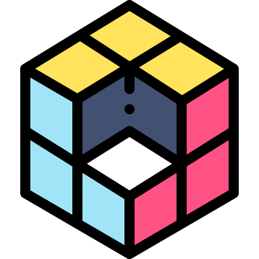
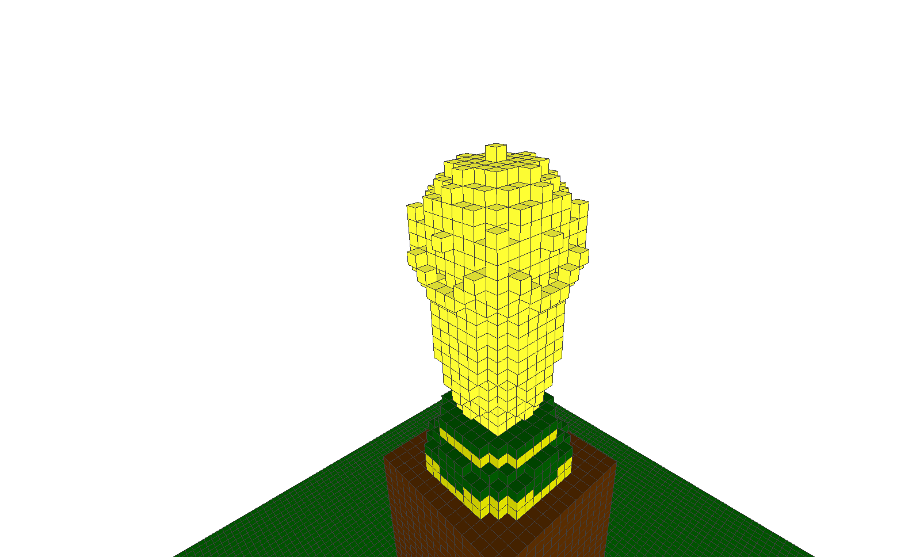

    
    

    <h1 align="center"> Projeto Escultor 3D </h1>

---

      

# Índice 

* [Indrodução](#introdução)
* [Parte 1](#parte-1)
* [Parte 2](#parte-2)
* [Documentação](#documentação)
* [Licença](#licença)
* [Links](#links)

### Progresso

- :white_check_mark: Parte 1
- :white_large_square: Parte 2

### Introdução
A idéia desse projeto é criar uma ferramenta, na linguagem C++, capaz de fazer esculturas 3D apartir de matrizes digitais. O projeto consiste em dois módulos: uma classe em C++ destinada à interpretação de um arquivo em formato de texto simples e geração das matrizes tridimensionais; e uma ferramenta visual para desenho, algo equivalente a um "paint" 3D.

### Parte 1
Nessa primeira parte foram desenvolvidas ferramentas capazes de fazer a escultura abaixo, alguns conhecimentos como alocação de matrizes, classes e estruturas foram introduzidos no projeto.

 

    <b>Troféu da Copa do Mundo FIFA</b>

    

<a  
    href= "https://www.r7.com/B1nQ" 
    tittle= "Troféu da copa do mundo FIFA" > link da imagem       
</a>
 por Edu Garcia/R7.

 

**Conhecimentos necessários:**
- Alocação dinâmica de memória.
- Criação da estrutura Voxel.
- Criação da classe Sculptor.
- Manipulação de dados em arquivos.

 

    <b>Escultura 3D (PNG)</b>

    

 

    <b>Escultura 3D (GIF)</b>

    

 

Para visualizar a utilização dos membros da classe Sculptor, acesse a documentação [aqui](#documentação).

### Parte 2

> :construction: Segunda parte do projeto em construção :construction:

### Documentação

* **Documentação da Parte 1** ([aqui](https://franssoares.github.io/html/))

* **Documentação da Parte 2**

### :link:Links
* **Logo:** <a href="https://www.flaticon.com/free-icons/rubik" title="rubik icons">Rubik icons created by Freepik - Flaticon</a>

---
### Licença

Projeto Escultor 3D é [Creative Commons Zero v1.0 Universal](https://github.com/Franssoares/Projeto-Escultor-3D/blob/main/license).